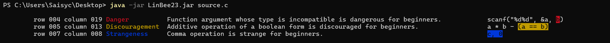

Why not try LinBee23? Just download `LinBee23.jar` and `source.c`!

```c
#include <stdio.h>
int a, b, c;
int main() {
	scanf("%d%d", &a, b);
	c = a * b - (a == b);
	printf("%d", c);
	return c, 0;
}
```



LinBee23 is an [SS23C99](../../../SSL/SSC/SS23C99) LFB used in fundamental programming courses of Beihang University in 2023 for beginners in C99 programming.

For almost all C99 codes not containing macros, type definitions, structures, unions or enumerations, the syntax trees constructed by LinBee23 are consistent with C99. Actually, in fundamental programming courses of Beihang University in 2023, for all codes not containing macros, type definitions, structures, unions or enumerations, the syntax trees constructed by LinBee23 are consistent with C99.